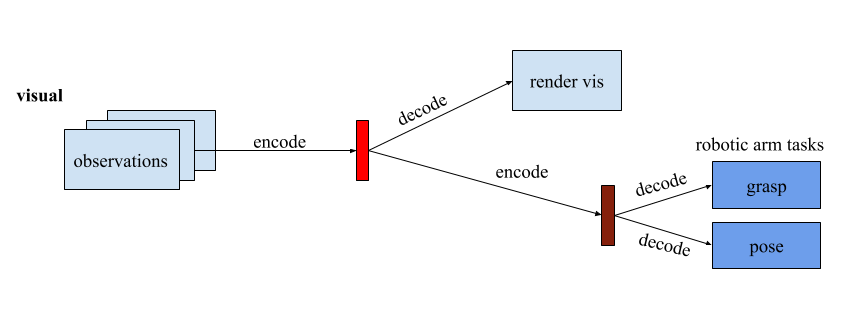
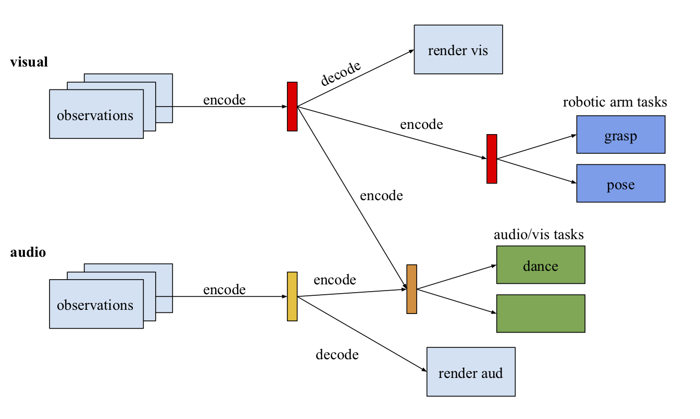

# Generative Query Network

This is a PyTorch implementation of the Generative Query Network (GQN)
described in the DeepMind paper "Neural scene representation and
rendering" by Eslami et al. For an introduction to the model and problem
described in the paper look at the article by [DeepMind](https://deepmind.com/blog/neural-scene-representation-and-rendering/).


# Recursive GQN
This repository is part of an ongoing research into GQN's potential for transfer learning and implements a "recursive" variant of the model which enables higher level, specialized, scene representations that can be shared across tasks.

The authors demonstrate that the scene representation can be used to reduce the number of training steps for a robotic arm grasping task by 75%.  Using the scene representation rather than input directly makes sense given it is lower dimensional, and this lower dimensional space "specializes" in storing the most important features of the scene for it to be rerendered.

In the context of this Recursive GQN, this would be an example of "layer 1" transfer learning, as we use the first (and only in this case) scene representation as input to another task, which significantly speeds up training.


However, this can be extended recursively such that we use the initial, layer 1 scene representation as the input to another GQN-like model, whose "generator" model used to tune the representation model is any task.  This is illustrated below.



In doing so, we create a "layer 2" scene representation that specializes in this case on representing the scene details needed to complete various robotic arm tasks.  You can think of it as the robotic arm's perception of the scene.  We use this representation as the input for the robotic arms pose task rather than the layer 1 representation because the layer 2 representation network has already been trained to encode the features of the scene useful to the robotic arm.  This should help the pose model learn even faster.  The aim of this research is to test the effectiveness of this hierarchy of specialized scene representations for transfer learning.

## Future
Eventually, I would like to test the extensibility of this model, specifically in the context of adding new input sources that can enable higher quality scene representations.  For example, as humans, we use a variety of senses besides sight to create our mental models of the world around us.  My hope is that we can add additional encoding models onto existing models.  This could be done by creating scene representations for each sense, and then feed these into an encoding network that outputs the layer 1 state representation.  However, as illustrated in the image below, we could also allow tasks to select which input source or "sense" they want to use as input.



#### Downloading and Converting Data
The current implementation generalises to any of the datasets described
in the paper. However, currently, *only the Shepard-Metzler dataset* has
been implemented. To use this dataset you can use the provided script in
``` bash
sh data.sh data-dir batch-size
# for example
sh data.sh .. 20
```
##### As of now, the above script has problems converting some but not all of the dataset.

#### Train Model
The model can be trained in full by in accordance to the paper by running the
file `run-gqn.py` or by using the provided training script
``` bash
sh gpu.sh data-dir
# for example
sh gpu.sh ../shepard_metzler_5_parts
```

## Roadmap
- setup train/test pipeline
- library for easy editing and visualizing of the model's structure
